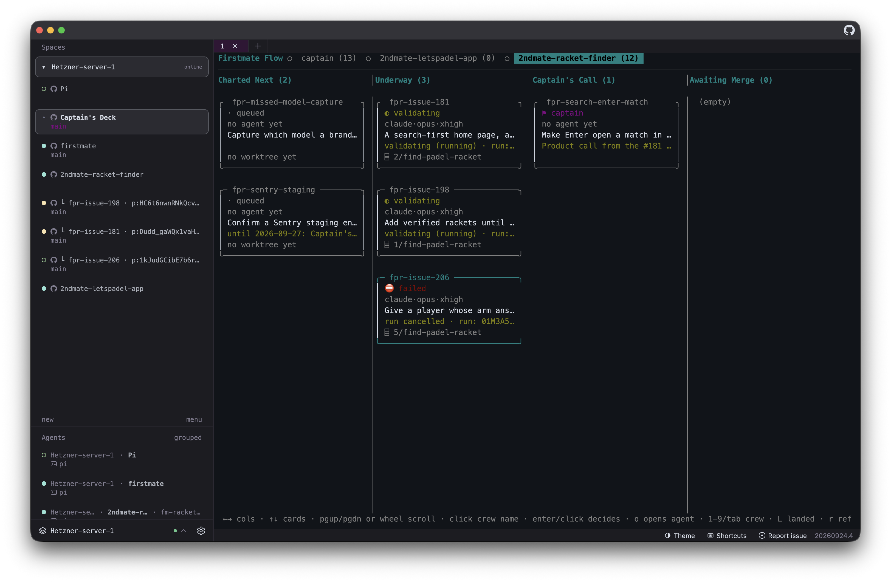
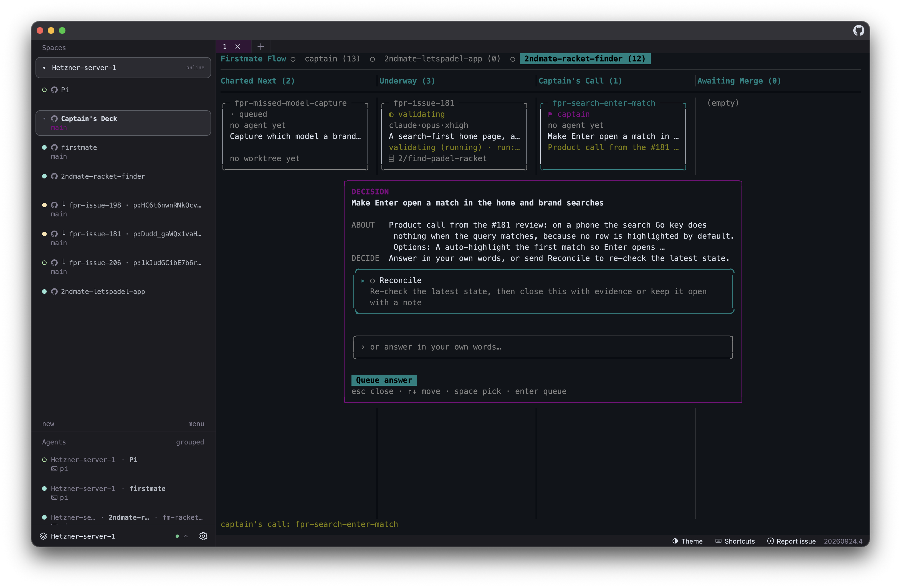

# Captain's Deck

**See the whole crew. Unblock what matters. Let Firstmate ship the rest.**

Captain's Deck is a read-only **[Firstmate flow](https://github.com/kunchenguid/firstmate)** kanban plugin for [Herdr](https://herdr.dev).
It is the captain's view of agent orchestration: small surface area, like [Pi](https://pi.dev/)—one board that does one job well instead of another dashboard to babysit.





Source: <https://github.com/deimantasnork/captains-deck>

## Why Captain's Deck

Parallel coding agents only feel like a crew when nothing important stalls in a forgotten tab.
[Firstmate](https://github.com/kunchenguid/firstmate) runs that crew for you: isolated worktrees per task, supervision until the work is actually finished, and a clean handoff when the session is done.
You are not on the hook to manually open pull requests, chase branch updates, resolve merge conflicts, or run end-to-end checks as a separate ritual—Firstmate's project modes (`no-mistakes`, `direct-PR`, `local-only`, and optional **`+yolo`** merge autonomy) prepare the PR, keep ship branches aligned with main, work through conflicts, and run the configured validation pipeline while the task closes.
When policy allows yolo, landing can happen without you clicking merge.

That automation still needs a captain for real decisions—and a place to notice when something is **blocked** or waiting on you.
Firstmate exposes those moments as **Captain's Call** tickets; everything else should keep moving without interrupting your flow.

Captain's Deck is that bridge: a kanban board where you can **identify blocking and decision work at a glance**, answer Captain's Call in place (options, note, queue—then Firstmate resumes the lane), and jump to the live Herdr pane when you need eyes on the agent.
The board stays read-only except those guarded keyed answers, so orchestration keeps running and you only touch what actually requires the captain.

## The board

One board, every crew: an **All** tab (first in the row) merges every captain
and secondmate home into one view — only work that is planned or still running
(Charted Next, Underway, Captain's Call, and Awaiting Merge). Landed rows stay
on each mate's own tab. After **All**, the captain home plus each secondmate
home appear as crew tabs. Each tab projects that home's bearings snapshot into
five fixed columns. Nothing is ever written back, with one deliberate exception: a
Captain's Call answer (see below), where the captain's own decision goes to
Firstmate's guarded keyed-answer intake.

| Column | Source |
| --- | --- |
| **Charted Next** | `gates` |
| **Underway** | every `in_flight` row (badges carry `shipping` / `validating` / `parked` / `paused` / `failed`) |
| **Captain's Call** | `decisions_open` - click a ticket to decide it in place |
| **Awaiting Merge** | `in_flight` rows whose Firstmate `state` is `done` (crew finished, waiting on merge/review) |
| **Landed** | `landed` — Firstmate's "Recently Landed": merged PRs, completed scouts, local-only merges (hidden by default here; toggle with `L`) |

Firstmate's own bearings has four sections (Underway, Charted Next, Captain's Call,
Recently Landed) and deliberately keeps run status out of the section split.
Awaiting Merge is the only added projection: Firstmate's own `state == "done"`
rows, which are the ones waiting on a merge.

The board uses **Firstmate's own bounds** by default (`FM_BEARINGS_LANDED` = 6
newest per home, gates/in-flight = 20). `FM_FLOW_ALL=1` requests every row.

Crew tabs show a live activity dot (`●` working/blocked, `○` agent present) and
the number of tickets on that board once it has been visited; a visited board
with no tickets shows `(0)`. **All** shows the fleet-wide planned/running count
(captain plus every secondmate); mate tabs count every column including Landed
when that column is visible.

## What each ticket shows

```text
╭─ demo-issue-197 ───────────────────╮
│ shipping                           │   live status badge
│ Add retry to the OAuth callback    │   title (or the "what" for landed)
│ editing auth/client.rs             │   why: gate / decision / doing detail
│ claude·opus·xhigh                  │   harness · model · thinking effort
│ 9min 59s ● 55.5k tok               │   total wall time · total tokens
│ ⌸ 4/my-app…                        │   worktree / PR jump target (crew on All)
╰────────────────────╯
```

The card reads top to bottom: id, live status, title, an optional why row, the
agent line, the run totals, and the jump target. The totals row sits between
the agent and the worktree — **total wall time since the task spawned** and
**total tokens** (Herdr detection, or cumulative Pi session usage) — and appears
while the agent is `shipping` or `blocked`. The why row shows a blocked-by, a
gate reason, the Captain's Call prompt, or a `doing` detail that says more than
the badge, and disappears when it would only repeat it.

Badges: `● shipping`, `◐ validating`, `⛔ blocked`, `⚑ decision` /
`⚑ captain`, `◍ awaits merge`, `⏸ parked` / `⏸ paused`, `⛔ failed`,
`✓ done` / `✓ landed`, `· queued`.
Live state comes from `herdr agent list`; activity and review state come from
Firstmate's bearings snapshot and the home's `state/<task>.status` tail.
Other states keep the symbolic badge only.

A totals row shrinks with the card instead of clipping: full
`9min 59s ● 55.5k tok`, then compact `9m59s ● 55.5k tok`, then
`9m59s ● 55.5k`.

## Answering a Captain's Call ticket

Clicking a Captain's Call ticket (or pressing `Enter` on it) opens its decision
card as a modal, composed from the same `fm-bearings-board.v1` card the Lavish
bearings board renders: the type badge and repo, the title, the `ABOUT` /
`DECIDE` context, every authored option with its hint, the `REC` mark on the
recommended one, a freeform note row, and **Queue answer**.

- `↑`/`↓` (or `j`/`k`) move, `space` picks or clears an option, typing edits
the note, `Tab` jumps between the options and the note, `Enter` queues, and
`esc` closes without answering.
- The answer is piped to Firstmate's one keyed-answer intake
(`bin/fm-captain-hold.sh answers`) in the home that owns the ticket, with this
Deck as its provenance. A card that declares `close: "release"` releases the
gated work instead of completing it.
- After the record lands, the Deck steers the agent that owns the call through
the parent home's lane inbox (`fm-send.sh`), so a released item resumes and a
re-check actually gets worked. A wake problem is shown beside the queued state;
the recorded answer is never reversed.
- `Reconcile` is the reserved value: it files a durable reconcile request
through `reconcile-requests`, binding `herdr-firstmate-flow` as its captured
source on first use, and never closes anything by itself. The call leaves
Captain's Call immediately - the snapshot buckets it `reconciling` and shows it
under Charted Next as `reconcile requested <time>` - and returns only if the
owner finds it still active.
- Card content is read from the live board, then the durable store the board
build writes (`state/decision-cards/<task>.json`), then the composed payload
history. That store is what keeps the authored options available after a board
rebuild.
- When no composed card exists for a ticket, the dialog still opens with its
durable title, its hold reason as the `ABOUT` line, a freeform answer, and
`Reconcile`.
- Nothing is resolved by the board itself: every guard, the durable decision,
and the close all live in Firstmate.

## Freshness: only what changed is refreshed

The board never redraws itself wholesale.

- **Live tick (2s):** the active board rebuilds its badges from cheap sources —
  Herdr's agent/pane list, each task's `state/<id>.meta` and the tail of
  `state/<id>.status` (both cached by mtime).
- **Bearings (20s):** the expensive `fm-bearings-snapshot.sh` run only happens
  when the cached snapshot is older than `FM_FLOW_BEARINGS_SECS`, when you switch
  to a crew that has no cached data, or when you press `r`.
- **Diff repaint:** only the screen lines that actually changed are written, so a
  badge updating does not disturb your scroll position, selection, or the rest of
  the board.
- **Only the active crew** is refreshed; other crews cost nothing while you look
  at one board.

## Interaction

| Action | What happens |
| --- | --- |
| Click a **crew name** (top row) | Switch instantly; **All** loads every mate's bearings; other tabs use cached cards first, then refresh |
| Click a **ticket** | Focus the ticket's Herdr tab/pane, which selects that agent in the Herdr agents sidebar |
| Click a Captain's Call **ticket** | Open its decision card modal and queue the captain's answer |
| Click a ticket with no live pane | Footer explains it, e.g. `demo-issue-198: no live pane · (no worktree yet)` |
| `1`…`9`, `Tab` / `Shift+Tab`, `[` / `]` | Switch crew |
| `←`/`→` or `h`/`l` | Move between columns |
| `↑`/`↓` or `j`/`k` | Move between tickets (the view follows the selection) |
| Mouse **wheel over a column** | Scroll that column smoothly (3 rows per notch) |
| `Shift`+wheel | Scroll every column together |
| `PgUp`/`PgDn`, `g`/`G` | Page / jump within the selected column |
| `Enter` | Decide the selected Captain's Call ticket; any other ticket opens its agent pane |
| `o` | Open the selected ticket's agent pane, including a Captain's Call one |
| `r` / `q` | Force a bearings refresh / quit |
| `L` | Show/hide the Landed column |

Input repaints immediately (no waiting for the next data tick), and a burst of
wheel events is coalesced into a single repaint. Scrolling moves by terminal
rows, so cards clip at the edges instead of jumping a whole 8-row card.

Ticket → pane mapping comes from the task's `state/<task>.meta`
(`herdr_pane_id`, `herdr_tab_id`, `herdr_workspace_id`), with a fallback to
matching the worktree path against live pane working directories. The `herdr`
binary is resolved from `HERDR_BIN_PATH`, then `PATH`, then `~/.local/bin/herdr`
(plugin panes inherit a minimal `PATH`).

## Theme

Ticket borders, badges, and column titles use the terminal's **ANSI palette**
(basic 16 colours, no hardcoded RGB or 256-colour indexes), so they follow
whatever palette the Herdr `[theme]` setting gives the panes.

## Requirements

- [Herdr](https://herdr.dev/) >= 0.9.0
- [Firstmate](https://github.com/kunchenguid/firstmate) homes with `bin/fm-bearings-snapshot.sh`
- `python3` (standard library only), no `jq` required

## Home discovery

Homes are discovered in this order (first match wins per path):

1. `FM_FLOW_HOMES` environment variable — `label=path label=path`
2. `homes.conf` in the plugin config directory — one `label=path` per line
3. `FM_HOME` or the legacy `fm_home` config file
4. `~/firstmate` plus `~/.treehouse/*/*/firstmate` worktree homes

A home is shown when it has task directories **or** a live Herdr agent running
in it. An unleased spare treehouse worktree - no lease holder, no presentation
label, no live agent - is hidden, because it is a slot rather than a crew. Labels come from the treehouse lease holder
(`~/.treehouse/*/treehouse-state.json`) or a task's
`state/*.herdr-presentation` `parent_label`, so secondmates appear as e.g.
`2ndmate-demo`.

Plugin config lives in:

```text
~/.config/herdr/plugins/config/herdr-firstmate-flow/
  fm_home        # legacy single-home config (still honored)
  homes.conf     # optional label=path list
  show_landed    # optional: 0 hides the Landed column
  debug_log      # optional: a path, or an empty file for <config>/debug_log.log
```

Environment knobs:

| Variable | Default | Meaning |
| --- | --- | --- |
| `FM_FLOW_TICK_SECS` | `2` | Live badge/agent refresh |
| `FM_FLOW_BEARINGS_SECS` | `20` | Bearings snapshot TTL |
| `FM_FLOW_WHEEL_ROWS` | `3` | Rows moved per wheel notch |
| `FM_FLOW_LANDED_LIMIT` | `10` | Safety cap on landed cards (Firstmate's own bound is 6/home) |
| `FM_FLOW_SHOW_LANDED` | `1` | Show the Landed column (`0` = hide it, also toggleable with `L`) |
| `FM_FLOW_ALL` | `0` | `1` = request every row from bearings instead of Firstmate's bounds |
| `FM_FLOW_HOMES` | — | Explicit `label=path` crew list |
| `FM_FLOW_DEBUG` | — | Append click/collector debug lines to this file |

## Open the board

- Action **Open flow board** — floating overlay pane
- Action **Open captain's deck** — full board in a dedicated `captain's deck`
  workspace (created on first use, refocused afterwards)
- Or bind keys in `~/.config/herdr/config.toml`

Press `q` in the pane to exit.

## Install / share

```bash
herdr plugin install deimantasnork/captains-deck
herdr plugin enable herdr-firstmate-flow
```

Local development:

```bash
herdr plugin link /path/to/herdr-firstmate-flow
```

Probe without a TTY (useful for CI or troubleshooting):

```bash
scripts/kanban-view.sh --homes        # list discovered homes
scripts/kanban-view.sh --once         # one plain-text frame, all homes
scripts/kanban-view.sh --once --home 2ndmate-demo
```

Herdr's plugin marketplace indexes public GitHub repositories tagged with the
`herdr-plugin` topic, and this repository is listed there:
<https://herdr.dev/plugins/>. Installation is still `herdr plugin install`.

## Contributing

Contributions are welcome — see [CONTRIBUTING.md](CONTRIBUTING.md) for the workflow, conventions, and how to run the checks.

Report bugs, ask questions, or suggest features with a [new GitHub issue](https://github.com/deimantasnork/captains-deck/issues/new) (templates optional; blank issues are allowed).

## Related projects

- [Herdr](https://herdr.dev/) — terminal workspaces, panes, and the agent host
  this plugin extends.
- [Herdr GPUI](https://github.com/penso/herdr-gpui) — native Rust/GPUI Herdr
  client used for the screenshots above.
- [Firstmate](https://github.com/kunchenguid/firstmate) — agent distro that runs
  the crew, closes worktrees into PRs (and optional yolo release), and owns the
  bearings snapshot and Captain's Call intake this board projects.
- [Pi](https://pi.dev/) — one of the supported primary harnesses; each ticket
  shows whichever harness, model, and thinking effort that home actually uses.
